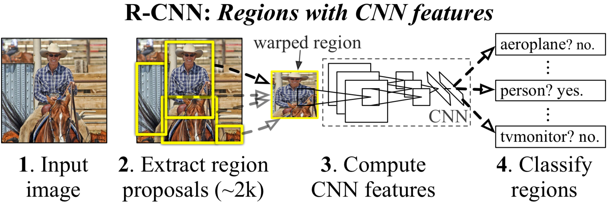

## motivation

由于传统HOG、SIFT等方法用于object detection速度慢，performance较低，R-CNN首次将CNN应用于object detection。相比较与HOG、SIFT等传统方法，R-CNN的mAP提高了接近30%，可以说重大突破了。

## method

网络分了三个阶段：

1. 产生很多region proposal

2. 利用fine-tuning之后的pre-trained模型提取feature vector
3. 每类都用一个SVM分类；

很有意思的是，R-CNN除了利用SVM对每个region proposal分类外，还利用region proposal的特征执行了bounding box回归，来修正region proposal的位置。R-CNN创新之处在于将回归问题转化为分类问题，而region proposal的产生，还是使用的传统的Selective Search。在此过程中，R-CNN可以说是将CNN的强大特征提取能力发挥到了极致。

R-CNN还能用于处理Semantic Segmentation，将候选区域当做语义类的分割结果。

